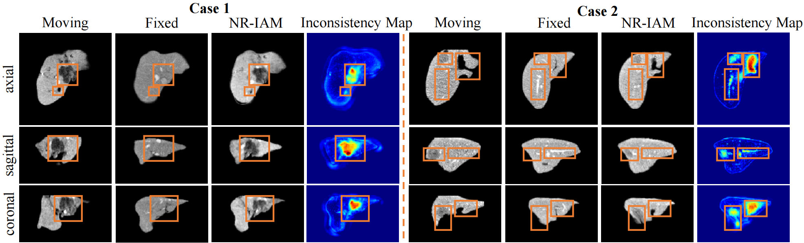

# Noise Removed Inconsistency Activation Map for Unsupervised Registration of Brain Tumor MRI between Pre-operative and Follow-up Phases
This is the implementation of the NR-IAM: **Noise Removed Inconsistency Activation Map for Unsupervised Registration of Brain Tumor MRI between Pre-operative and Follow-up Phases** 

## Visualization Results
### Inconsistency locating in the initial training phase.
To test the inconsistency-locating accuracy in the initial phase of training, we picked out 4 checkpoint after 10, 100, 500 and 1000 training iteration, and then visualize the warped image and inconsitency map. The results as below shows the great stability and precision of our NR-IAM in locating inconsistency even during the early training stage.

<!--  -->

### Visualization results of IAM and NR-IAM.
To present the denoising performance of our NMP process, we picked out 4 subjects and visulized their corresponding IAMs and NR-IAMs as follows.

### Generability to other modality and organ
The visualization of our proposed NR-IAM in T1 and T2 modality on [BraTS-Reg](https://www.med.upenn.edu/cbica/brats-reg-challenge) dataset. The regions hilighted in the yellow box prove that our NR-IAM can precisely locate the inconsistency across different MRI modality on BraTS-Reg.

Furthermore, we also evaluated the generalization performance of our method on the other organs, i.e., 3D liver CT [AWS_liver](http://medicaldecathlon.com/dataaws/) dataset. We preprocessed the dataset by:
  - extracting the whole liver using the segmentation mask 
  - affinely-pregistering other scans onto Liver_62
  - truncating the image with intensity value below the zero
  - min-max normalization

The visualization results are shown below.

